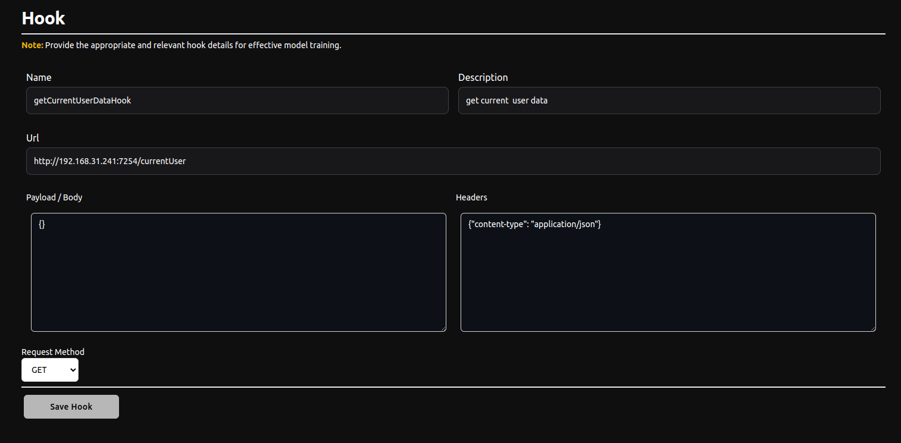

# Hooks

## What are hooks?

Amplizard hooks are a crucial feature, as they define how the chatbot should operate.

Hooks are your business's APIs. The bot identifies the customer’s intent and triggers the most relevant hook.

**For example**: If a customer requests an order cancellation, the bot will identify and trigger the appropriate hook, such as `cancelOrderHook`, with the required data.

**NOTE**:

- To ensure the chatbot functions correctly, you must first define a hook that returns the current user or customer data. Make sure to handle this in your backend for the hook **e.g.**: _Name(recommended)_: `getCurrentUserDataHook` _Description_: `get current user/customer data`.

- Use appropriate and descriptive hook names and descriptions to help the model learn effectively. **e.g.**: _Name_: `cancelOrderHook` _Description_: `Cancel the order using the user ID and order ID`.

- Ensure the hook includes necessary headers, such as the authorization header, for the chatbot to trigger them. Implement proper authentication and consider that the chatbot might need special permissions.

## Creating and Using Hooks

- Hooks can be created through the main Amplizard website. After setting up your bot, you can define and create the necessary hooks.

- At present, hooks can only interact with public API endpoints. Support for calling internal API endpoints via an internal system will be added soon.

{ align=left }
